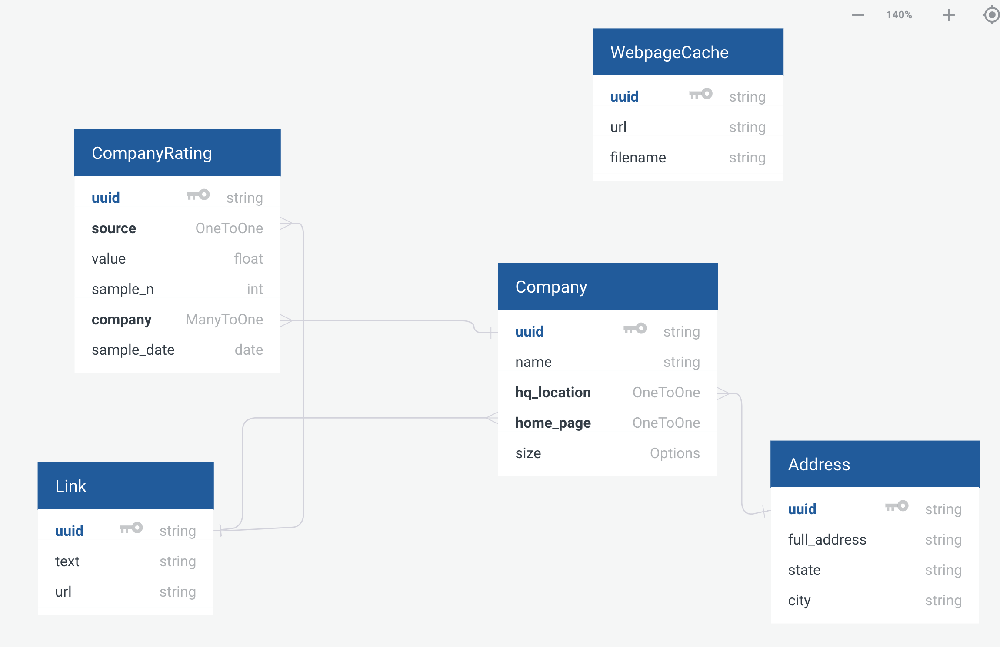

# SI 507 Final Project - Company Rating Data

Full Name of Author: Shaung Cheng

[Link to this repository](https://github.com/rivernews/Final-Project-si507)

---

## Project Description

My project will build a database that contains rating data for the top 500 fortune companies. The data will be collected mainly from the Glassdoor or Indeed’s company review rating data, and will collect the list of fortune 500 from the Fortune 500 website. 

We will do cross-site scrapping - first scrap the list of fortune 500, then find these companies in Glassdoor or Indeed. Our scrapper will be able to deal with asynchronous Ajax web page as well. If time allows - the project will allow users to have access to these company data in an organized and structured way and help them get insight from the data. Users can filter data based on company size, region or other criteria, and check out the corresponding charts to see any trend or pattern and hopefully help them decide what type of companies they want to pursue their career at. The backend will serve as a REST API to provide data for the frontend, and the routes will serve the endpoints of the API. 

## How to run

1. First, you should install all requirements with `pip install -r requirements.txt`)
2. [ ] TODO

## How to use

1. [ ] TODO
1. [ ] TODO (Optional): Markdown syntax to include an screenshot/image: 

## Routes in this application
- `/` -> this is the home page
- `/companies/` -> master view showing list of companies.
- `/companies/<int: id>` -> detail view of each company and their rating.

## How to run tests

1. Make sure you cd into project root directory.
1. Make sure you activate virtual environment.
1. `python SI507project_tests.py`

## In this repository:

- doc
    - img
        - Image files for README.md
- `browser.py`
- `database.py`
- `SI507project.py`

TODO

## Roadmap
- Web Scrapping
- Data ETL
    - [ ] Take company name, fortune 500 rank, sampled date & rating data
    - [ ] Do you want to store fortune 500 ranking? Where do you want to store it? `CompanyRating` might be a good place.
    - [ ] Database manager's `create()` has to return id of the object created. This is important for setting up one-to-many fields.
    - (optional: other company data specified in database schema)
- Database & Cache
    - **Cache webpage**
        - [x] Store url-filename pairs in database
        - [x] When selenium navigate_to is called, check if the url is in db
    - [ ] Store data in database using database manager class.
    - (optional: store web page in database)
- Flask app
    - `/`: home page
    - `/companies/`: master view
    - `/companies/<int: id>`: detail view
- Writing Test cases
    - [ ] Test scrapping functionality
    - [ ] Test routes

## Data Schema

Or [access online](https://app.quickdatabasediagrams.com/#/d/oo35Ob).

Explanations on some fields:

- CompanyRating
    - `sample_n`: the amount of rating data. The `value` is the average rating, and `sample_n` indicates the amount of ratings. This is an important factor when evaluating ratings. If n is too small, the rating means little and you probably should not take it seriously.
    - `value`: the rating value scrapped from the web page. This is usually the average of all ratings, assumed that the website did not use other way to compute the overall company rating.
    - `source`: where the rating data comes from, i.e., glassdoor, indeed, or other rating website.
- Company
    - `size`: the size of the company. This can be an important factor for jon seeker as well. It also affects the company culture more or less.
- Link
    - Link will just serve for OneToOne relationship so that other table can avoid having too much flatten fields.
- Address
    - Similar to Link, serve as OneToOne field for other tables about address information.

---
## Code Requirements for Grading
Please check the requirements you have accomplished in your code as demonstrated.
- [x] This is a completed requirement.
- [ ] This is an incomplete requirement.

Below is a list of the requirements listed in the rubric for you to copy and paste.  See rubric on Canvas for more details.

### General
- [ ] Project is submitted as a Github repository
- [ ] Project includes a working Flask application that runs locally on a computer
- [ ] Project includes at least 1 test suite file with reasonable tests in it.
- [ ] Includes a `requirements.txt` file containing all required modules to run program
- [ ] Includes a clear and readable README.md that follows this template
- [ ] Includes a sample .sqlite/.db file
- [x] Includes a diagram of your database schema
- [ ] Includes EVERY file needed in order to run the project
- [ ] Includes screenshots and/or clear descriptions of what your project should look like when it is working

### Flask Application
- [ ] Includes at least 3 different routes
- [ ] View/s a user can see when the application runs that are understandable/legible for someone who has NOT taken this course
- [ ] Interactions with a database that has at least 2 tables
- [ ] At least 1 relationship between 2 tables in database
- [ ] Information stored in the database is viewed or interacted with in some way

### Additional Components (at least 6 required)
- [ ] **Use of a new module**
- [ ] Use of a second new module
- [ ] Object definitions using inheritance (indicate if this counts for 2 or 3 of the six requirements in a parenthetical)
- [ ] A many-to-many relationship in your database structure
- [ ] At least one form in your Flask application
- [ ] Templating in your Flask application
- [ ] **Inclusion of JavaScript files in the application**
- [ ] **Links in the views of Flask application page/s**
- [ ] Relevant use of `itertools` and/or `collections`
- [ ] **Sourcing of data using web scraping**
- [ ] **Sourcing of data using web REST API requests**
- [ ] Sourcing of data using user input and/or a downloaded .csv or .json dataset
- [ ] Caching of data you continually retrieve from the internet in some way

### Submission
- [ ] I included a link to my GitHub repository with the correct permissions on Canvas! (Did you though? Did you actually? Are you sure you didn't forget?)
- [ ] I included a summary of my project and how I thought it went **in my Canvas submission**!

## Reference & Resources

- [Proposal Link](https://paper.dropbox.com/doc/SI507-Final-Project-by-Shaung-Cheng--Aa3swZraJVTqmfX6hACLwYLsAQ-W3RLpuHtj7eeItw4Hw4SI).

- [Database schema design tool.](https://app.quickdatabasediagrams.com/#/d/oo35Ob)

- [Repository URL](https://github.com/rivernews/Final-Project-si507)

