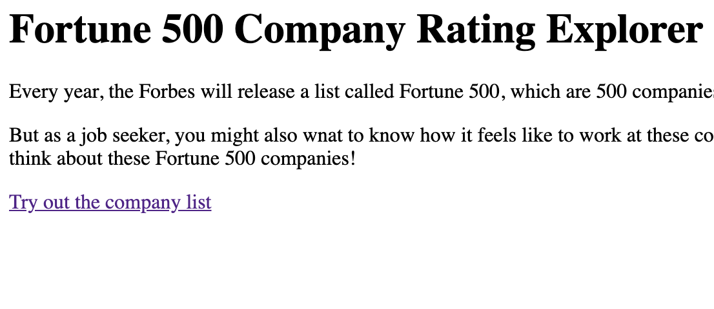
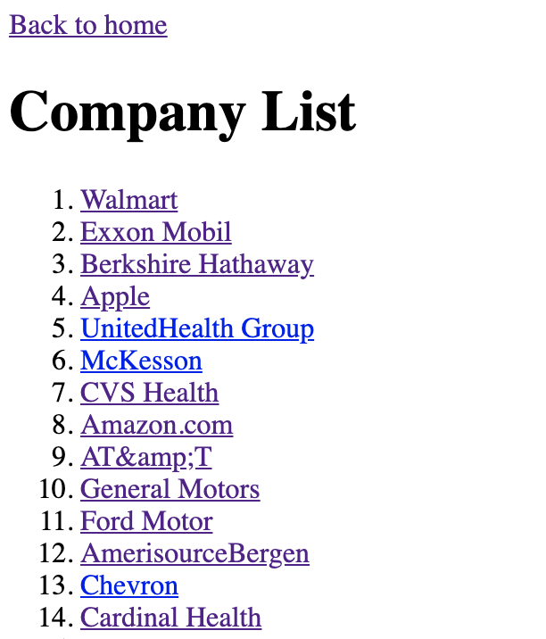
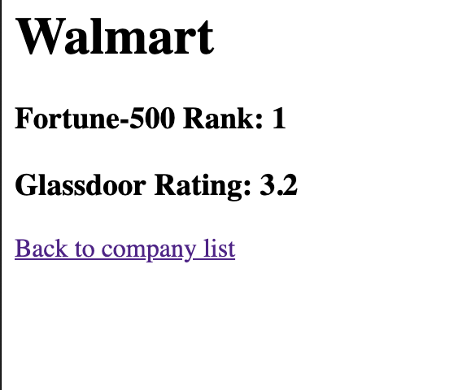

# SI 507 Final Project - Company Rating Data

Full Name of Author: Shaung Cheng

[Link to this repository](https://github.com/rivernews/Final-Project-si507)

---

## Project Description

My project will build a database that contains rating data for the top 500 fortune companies. The data will be collected mainly from the Glassdoor or Indeed’s company review rating data, and will collect the list of fortune 500 from the Fortune 500 website. 

We will do cross-site scrapping - first scrap the list of fortune 500, then find these companies in Glassdoor or Indeed. Our scrapper will be able to deal with asynchronous Ajax web page as well. If time allows - the project will allow users to have access to these company data in an organized and structured way and help them get insight from the data. Users can filter data based on company size, region or other criteria, and check out the corresponding charts to see any trend or pattern and hopefully help them decide what type of companies they want to pursue their career at. The backend will serve as a REST API to provide data for the frontend, and the routes will serve the endpoints of the API. 

## How to run

1. First, you should install all requirements with `pip install -r requirements.txt`). Also make sure you are running with Python 3.
2. At the project root directory, run `python flask_server.py` to start the web server locally and navigate in your browser to `http://127.0.0.1:5000/`.

## How to use I - viewing rating data in flask web app

1. After you start running the web server and navigate to `http://127.0.0.1:5000/`, you can click the link `Try out the company list` to see a list of companies of Fortune 500.

*Home Page of the Flask Web App*

*Company List Page*

2. For each company you can clik on the company name to go to their detail page. The detail page shows the Fortune 500 ranking of the company, along with its glassdoor rating.

*Detail Page*

## How to use II - tryout the web scrapper yourself

A big part of this project is web scrapping, so if you want to see how it actually looks like for Selenium to do cross site scrapping & dealing with Ajax infinite scroll webpage, follow the steps below:

1. Go to the project root directory, also make sure you also have a virtual environment activated, and did `pip install -r requirements.txt`.
1. The `settings.py` in project root directory contains several options for how you want the Selenium browser to scrap:
    - `BROWSER_HEADLESS`: if you set to `True`, Selenium will not show the browser window while crawling. I recommend you set to `False` (be default) so you can see how the crawler is doing under the hood. But you can set to `False` if you just want to scrap the data and find the browser window annoying. Setting it to `False` will hide the browser window and speed up the crawling.
    - `BROWSER_SMOOTH_SCROLLING`: it's only meaningful if `BROWSER_HEADLESS` is set to `False`. Enabling this will let the Selenium browser scroll smoothly instead of an instant jump. I recommend setting it to `True` for you to see how the crawler is doing under the hood.
    - `SCRAP_COMPANY_AMOUNT`: you can choose how many company you want to scrap. For example. if you give `20`, the crawler will scrap companies data from Fortune-500 rank 1st to 20th. The crawler always starts scrapping from the rank 1st company of Fortune-500.
1. At root project directory, run `python SI507project.py`. 
    - ⚠️ Note that the crawler has caching mechanism so it will not go through the entire process at first. It will use the existing database `my-database.sqlite` in the project root directory. If a web page is cached and has an entry in database, the crawler will not request the page and will use the HTML file in the `cache/` directory instead. Likewise, if a company or a rating data is already in database, it will not crawl the webpage and will use the data from database instead.
1. In order to see the entire process of how crawler interact with the webpage, I recommend you delete the database to start over. Follow the instructions below:
    1. Delete the database `my-database.sqlite` in the project root directory.
    1. (Optional) you can delete all HTML files under directory `cache/`, but it does not matter. If the crawler cannot find a cache in database, it will request and overwrite the HTML file anyway.
    1. You probably want to set `SCRAP_COMPANY_AMOUNT` in the `settings.py` (in project root direocty) to a smaller number to just see how things look like to avoid long wait. I recommend 5. The crawler will cache all company and webpage data so feel free to increase this number later and re-run the crawler.
    1. TO run the crawler, at root project directory, run `python SI507project.py`.
    1. The overall process is like this: the crawler 1) scraps Fortune 500 list, 2) for each company, query the company in glassdoor, retrieve the glassdoor page and extract the rating. The webpage of Fortune 500 list has infinite scroll, and in fact, the page contains 1000 companies in total. By default the crawler will wait till all 1000 companies are loaded, then cache the page and move on. It might take 1~2 minutes for all the 1000 companies are loaded.
    1. Once you run the crawler, you can observe the Selenium browser e.g. how it scrolls down, open new webpage.... Also you can observe the files under directory `cache/` and see the cached webpage HTML files. You can also use database client and open the database `my-database.sqlite` to see how company data are stored.

## Routes in this application
- `/` -> this is the home page
- `/companies/` -> master view showing list of companies.
- `/companies/<int: id>` -> detail view of each company and their rating.

## How to run tests

1. Make sure you cd into project root directory.
1. Make sure you activate virtual environment.
1. `python SI507project_tests.py`

If you also want to test caching:

1. Delete database
1. (optional) Delete all files under `cache/`.
1. Re-run `python SI507project_tests.py`.

## In this repository:

- doc
    - img
        - Image files for README.md
- `browser.py`
- `database.py`
- `SI507project.py`

TODO

## Data Schema

Or [access online](https://app.quickdatabasediagrams.com/#/d/oo35Ob).

Explanations on some fields:

- CompanyRating
    - `sample_n`: the amount of rating data. The `value` is the average rating, and `sample_n` indicates the amount of ratings. This is an important factor when evaluating ratings. If n is too small, the rating means little and you probably should not take it seriously.
    - `value`: the rating value scrapped from the web page. This is usually the average of all ratings, assumed that the website did not use other way to compute the overall company rating.
    - `source`: where the rating data comes from, i.e., glassdoor, indeed, or other rating website.
- Company
    - `size`: the size of the company. This can be an important factor for jon seeker as well. It also affects the company culture more or less.
- Link
    - Link will just serve for OneToOne relationship so that other table can avoid having too much flatten fields.
- Address
    - Similar to Link, serve as OneToOne field for other tables about address information.

---
## Code Requirements for Grading
Please check the requirements you have accomplished in your code as demonstrated.
- [x] This is a completed requirement.
- [ ] This is an incomplete requirement.

Below is a list of the requirements listed in the rubric for you to copy and paste.  See rubric on Canvas for more details.

### General
- [x] Project is submitted as a Github repository
- [x] Project includes a working Flask application that runs locally on a computer
- [x] Project includes at least 1 test suite file with reasonable tests in it.
- [x] Includes a `requirements.txt` file containing all required modules to run program
- [x] Includes a clear and readable README.md that follows this template
- [x] Includes a sample .sqlite/.db file
- [x] Includes a diagram of your database schema
- [x] Includes EVERY file needed in order to run the project
- [ ] Includes screenshots and/or clear descriptions of what your project should look like when it is working

### Flask Application
- [x] Includes at least 3 different routes
- [x] View/s a user can see when the application runs that are understandable/legible for someone who has NOT taken this course
- [x] Interactions with a database that has at least 2 tables
- [x] At least 1 relationship between 2 tables in database
- [x] Information stored in the database is viewed or interacted with in some way

### Additional Components (at least 6 required)
- [x] **Use of a new module**
- [ ] Use of a second new module
- [x] Object definitions using inheritance (indicate if this counts for 2 or 3 of the six requirements in a parenthetical)
- [ ] A many-to-many relationship in your database structure
- [ ] At least one form in your Flask application
- [x] Templating in your Flask application
- [ ] **Inclusion of JavaScript files in the application**
- [x] **Links in the views of Flask application page/s**
- [ ] Relevant use of `itertools` and/or `collections`
- [x] **Sourcing of data using web scraping**
- [ ] **Sourcing of data using web REST API requests**
- [ ] Sourcing of data using user input and/or a downloaded .csv or .json dataset
- [x] Caching of data you continually retrieve from the internet in some way

### Submission
- [ ] I included a link to my GitHub repository with the correct permissions on Canvas! (Did you though? Did you actually? Are you sure you didn't forget?)
- [ ] I included a summary of my project and how I thought it went **in my Canvas submission**!

## Reference & Resources

- [Proposal Link](https://paper.dropbox.com/doc/SI507-Final-Project-by-Shaung-Cheng--Aa3swZraJVTqmfX6hACLwYLsAQ-W3RLpuHtj7eeItw4Hw4SI).

- [Database schema design tool.](https://app.quickdatabasediagrams.com/#/d/oo35Ob)

- [Repository URL](https://github.com/rivernews/Final-Project-si507)

- [How to use regex to do replace in Python](https://stackoverflow.com/questions/11475885/python-replace-regex)

- [How to return id after insert using SQL in python?](https://stackoverflow.com/questions/2548493/how-do-i-get-the-id-after-insert-into-mysql-database-with-python)

- [How to make Selenium run in the background?](https://stackoverflow.com/questions/16180428/can-selenium-webdriver-open-browser-windows-silently-in-background)